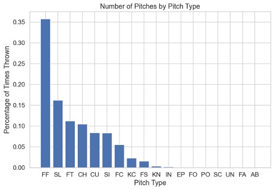
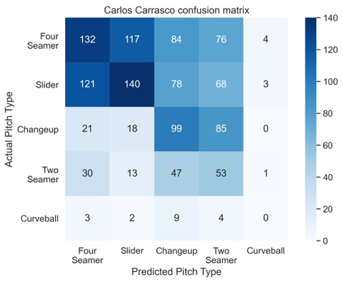
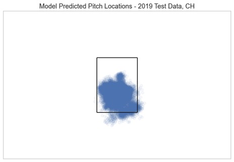
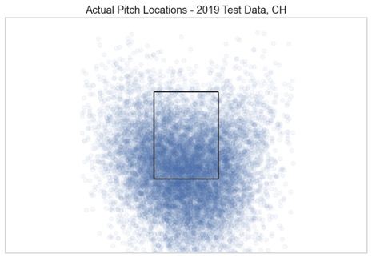

# Predicting MLB Pitch Types :baseball:
## By: Patrick Bovard
### *Final Passion Project for Metis Winter 2021*

### Project Intro Information 
**Project Description:** For my final project at Metis, I decided to combine my passion for Data Science with lifelong fandom of baseball.  The challenge was, could I build a model to predict the pitch type, and location, that a given pitcher will throw?

**Data Sources:** Data from the following sources has been utilized in this project:  
- Paul Schale's [MLB Pitch Data Kaggle Dataset](https://www.kaggle.com/pschale/mlb-pitch-data-20152018?select=games.csv).  Includes MLB Pitch data from 2015-2019.
- Baseball Savant's [website](https://baseballsavant.mlb.com/).  This site was used to look at pitch trends by pitchers over time, as seen in my final presentation.  
- [FanGraphs Custom Leaderboards](https://www.fangraphs.com/leaders.aspx?pos=all&stats=bat&lg=all&qual=y&type=5&season=2019&month=0&season1=2015&ind=0&team=0&rost=0&age=0&filter=&players=0&startdate=2015-01-01&enddate=2019-12-31).  Data from here was used to cluster hitters into different "types" of hitters.

**Main Tools Utilized:** 
- Data Analysis and Model Building: Python, Pandas, Numpy, Scikit-Learn, SQL-Alchemy, PostgreSQL  
- Pitch Location: Linear Regression Modeling
- Pitch Type Classification: XGBoost Classification Modeling  
- Batter Clustering: K-Means Clustering

**Model Features:**
The features in this model fell into one of three different "buckets".  The key was to only utilize features a hitter could know before a pitch is thrown - otherwise, they can't use it to prepare.
- Game Situation: Number of outs, number of balls/strikes, runners on base, score, etc.
- Batter Information: Hitter Type (i.e. power, contact, weaker hitter), Hitting side (right handed or left handed)
- Pitcher Stats: running proportions of the pitch types the pitcher throws, what pitch they threw most recently, what pitches they've thrown in their last 5 pitches

**Possible Impacts:** Possible impacts of this project are as a gameplanning tool, that a batter could use to prepare.  While it couldn't be utilized mid-game, it could be used as a preparation tool while getting ready to face a certain pitcher, to create customized scouting reports for hitters based on situations they may see.

### High Level Project Results:
For this project, I utilized a multistep process in building out my model.  This included:
1. Organizing the Kaggle Dataset into a PostgreSQL database, in order to join, query, and engineer new features
2. Run K-Means clustering on hitting statistics, to group similar types of hitters together, without adding the complexity of many different stats
3. Build out a classification algorithm to predict pitch type
4. Feeding the pitch type predictions into a two step regression algorithm to predict the pitch's x and y coordinates to get a location prediction

The initial dataset contained about 3.5 million pitches, with 18 different pitch types with varying amounts of times thrown, leading to an inherent multi-class problem with a class imbalance between pitch types.

 

Complicating things, is that each pitcher throws a different mix of pitch types, in different proportions.  Due to this pitching style, I decided to build a pipeline to train and validate a model on individual pitchers.

Overall, I developed models on 50 different pitchers.  Below are the validation scores on various metrics on the training/validation data, which covered the 2015-2018 seasons.  

| Model Type              | Last x Pitch Counts Features         | Accuracy  | Precision | Recall  |F1   |Px MAE   |Pz MAE   | 
| ------------------------|------------------| ----------|-----------|---------|-----|---------|---------|
|Random Forest, Lin. Reg. |Last 100 pitches  | .465      | .351      | .295    |.320 |.643     | .663    | 
| Random Forest, Lin. Reg | Last_10_pitches  | .468      | .353      | .292    |.318 |.643     | .663    | 
| XGBoost, Lin. Reg       | Last_10_pitches  | .463      | .363      | .316    |.337 |.643     | .663    |
| Random Forest, Lin. Reg | Last_5_pitches   | .470      | .361      | .294    |.322 |.643     | .663    |
| XGBoost, Lin. Reg       | Last_5_pitches   | .463      | .360      | .316    |.336 |.643     | .663    |

Based on these, I went with the **XGBoost Classifier with Linear Regression for Pitch Location, using the last 5 pitch type counts.**. 

**Final Model - Test Results:**
For evaluating the models, I utilized data from the 2019 season as the test set, to simulate trying to predict on a new season's data.  Across the 50 pitchers, the mean test accuracy was **31%**, with an identical **23%** rate for non-primary pitch type precision and recall.  For one example of predictions, below is a confusion matrix for one pitcher, Carlos Carrasco:

 

While the performance varied by pitcher, it did provide some insight into how each pitcher pitches, and how well the given features can predict for that certain pitcher.

When it came to location, the model was able to generally predict the general location of the pitch, which is more useful than an exact coordinate pair.  For example, below is the predicted and actual locations for a changeup, a pitch typically thrown low in the strikezone to induce weak contact from the batter.  

 

 

While real life pitches will have more variance due to inherent variability in throwing a baseball to an intended location, the model was able to pick up on the general area of where the pitcher was trying to throw the pitch tye.

**Future Improvements:**
For this project, I will be attempting to improve the model predictability as a future improvement, in order to capture some of the struggle points (i.e. drastic changes in pitch type selection by a pitcher from season to season).

Additionally, a streamlit web app is under development, and once the link is live it will be posted here.

### Navigating the repo:
Below has a main overview of the files in my repo, and what each folder contains.  For more detailed information, check out the Table_of_Contents.ipynb notebook in the main area of the repo.  *Note: several code files refer to a "Data" folder.  This was added to .gitignore due to the large file size and does not appear in this GitHub repo.*
- **MLB_Pitch_Data_Setup_SQL Folder:** This folder houses notebooks and code used to create SQL database of data from the [Kaggle dataset](https://www.kaggle.com/pschale/mlb-pitch-data-20152018?select=games.csv) mentioned above.   
- **EDA-SQL Folder:** This folder contains code on initial EDA of the data, including SQL and Pandas code to structure the dataset in preparation for machine learning.  
- **Clustering Folder:** This folder houses code on using K-Means clustering on batters, in order to dimensionally reduce the features with batters to feed into the machine learning algorithms.
- **Pitch_Classification Folder:** This folder contains code on building the following machine learning models: 
  - Classification: Determining pitch type
  - Linear Regression: Predicting pitch location (x and y coordinates)  
- **Pitch_Classification_Folder:** This folder contains my code on building out the machine learning models.  This is divided into subfolders:
  - Modeling_Preparation, to prepare the dataframe/features for modeling
  - Individual_Pitcher_Runs, to establish the General Pipeline for modeling
  - Pipeline_Building, to develop a pipeline for chaining together the regression and classification algorithms, and to incorporate various pitchers
  - Final_Modeling: contains notebooks and functions utilized in the final model
- **Feature_Engineering_Additional Folder:** This folder contains code on running additional feature engineering to utilize in my modeling process.  
- **Final_Presentation Folder:** This folder contains my final presentation slides, in PDF and Powerpoint file formats.  
- **Streamlit_App Folder:** This folder contains the script for running the Streamlit App to show my final model and results. *Note: this is currently under construction.*

